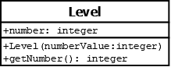

# Level

## Summary
Stores the information relevant to a particular level of the game.

## Diagram

## Attributes
* **number** (integer): represents which level this is and where it falls in the order of the game

## Constructors
* **Level(numberValue)**: constructs a `Level` object with the `number` attribute set to `numberValue`.

## Methods
* **getNumber()** (integer): returns the `number` attribute's value.
