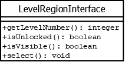

# LevelRegionInterface

## Summary
Hides the information about the model except for that needed by the LevelRegionView.
***This is an interface.***

## Diagram

## Methods
* **getLevelNumber()** (integer): returns the level number corresponding to this region.
* **isUnlocked()** (boolean): returns `true` if this region has been unlocked by the player; else returns `false`.
* **isVisible()** (boolean): returns `true` if this region's button should be displayed in the UI; else returns `false`.
* **select()** (void): the operation to perform when the region's button is clicked.
