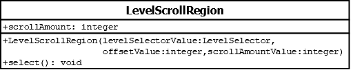

# LevelSelectionRegion

## Summary
Subclasses `LevelSelectionRegion` in order to reuse most of its code. Implements scroll behaviour in `select()`.

## Diagram

## Attributes
* **scrollAmount** (integer): The amount to move `levelSelector.baseIndex` by when `select()` is called. A positive value indicates that `levelSelector.baseIndex` should be increased; a negative value indicates that `levelSelector.baseIndex` should be decreased.

## Constructors
* **LevelSelectionRegion(levelSelectorValue (LevelSelector), offsetValue (integer), scrollAmountValue (integer))**: constructs a `LevelScrollRegion` object with the `levelSelector` attribute set to `levelSelectorValue`, the `offset` attribute set to `offsetValue`, and the `scrollAmount` attribute set to `scrollAmountValue`.

## Methods
* **select()** (void): overridden to implement scroll behaviour. calls `this.levelSelector.moveBaseIndex(this.scrollAmount)` in order to scroll up (or down if `this.scrollAmount` is negative).
