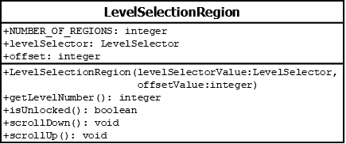

# LevelSelectionRegion

## Summary
Works with the `LevelSelector` object in order to get the appropriate model values to the `LevelRegionView`. Implements `LevelRegionInterface`

## Diagram

## Attributes
* **levelSelector** (LevelSelector): a reference to `LevelSelector` which manages the information about whether the `Level` corresponding to this region is locked and what its number is.
* **offset** (integer): a value used to tell `LevelSelector` which `Level` we are interested in.

## Constructors
* **LevelSelectionRegion(levelSelectorValue (LevelSelector), offsetValue (integer))**: constructs a `LevelSelectionRegion` object with the `levelSelector` attribute set to `levelSelectorValue`, and the `offset` attribute set to `offsetValue`.

## Methods
* **getLevelNumber()** (integer): returns the level number corresponding to this region. This is computed using `this.levelSelector.getLevelNumber(this.offset)`.
* **isUnlocked()** (boolean): returns `true` if this region has been unlocked by the player; else returns `false`. This is computed using `this.levelSelector.isLevelUnlocked(this.offset)`.
* **isVisible()** (boolean): returns `true` if `this.levelSelector.isOffsetValid(this.offset)`; else returns `false`.
* **select()** (void): calls `this.levelSelector.selectIndex(this.offset)` in order to select the `Level` associated with this region.
