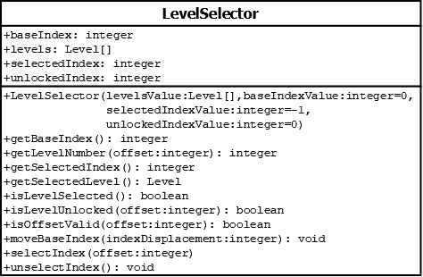

# LevelSelector

## Summary
Manages the `Level` objects in the context of which one is selected, which ones are unlocked, and what level information the region models should be retrieving.

## Diagram

## Attributes
* **levels** (Level[]): The levels in the game
* **regionIndex** (integer): the index of the `levels` collection attribute that `LevelRegion` objects should start getting `Level` objects from.
* **unlockedIndex** (integer): the index of the `levels` collection of the maximum level that the player has unlocked. All levels before that index are also considered to be unlocked. All levels after that index are considered to be locked.

## Constructors
* **LevelSelector(levelsValue (Level[]), regionIndexValue (integer), unlockedIndexValue (integer))**: constructs a `LevelSelector` object with the `levels` attribute set to `levelsValue`, and the `regionIndex` attribute set to `regionIndexValue` (which has a default value of `0`), and the `unlockedIndex` attribute set to `unlockedIndexValue` (which has a default value of `0`).

## Methods
* **getRegionIndex()** (integer): returns the value of the `regionIndex` attribute.
* **getRegionLevelNumber(offset (integer))** (Level): returns `this.levels[this.regionIndex + offset].getNumber()`. The `offset` parameter has a default value of `0`
* **isRegionLevelUnlocked(offset (integer))** (boolean): returns `true` if `this.regionIndex + offset <= this.unlockedIndex`; else returns `false`.
* **moveRegionIndex(indexDisplacement (integer))** (void): changes `regionIndex` by the passed in `indexDisplacement` value. If `indexDisplacement` is positive, then `regionIndex` is increased; otherwise it is decreased.
