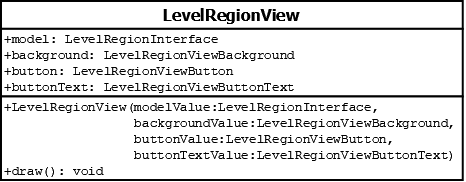

# LevelRegionView

## Summary
Represents one of the seven parts of the tower to draw.

## Diagram

## Attributes
* **model** (LevelRegionInterface): the model object to use for determining what the view displays and how it displays things.
* **background** (LevelRegionViewBackground): the background sprite upon which the button will be drawn.
* **button** (LevelRegionViewButton): the button associated with selecting a level or scrolling up / down.
* **buttonText** (LevelRegionViewButtonText): the text to display on the button.

## Constructors
* **LevelRegionView(model (LevelRegionInterface), backgroundValue (LevelRegionViewBackground), buttonValue (LevelRegionViewButton), buttonTextValue (LevelRegionViewButtonText))**: constructs a **LevelRegionView** object with the `model` attribute set to `modelValue`, the `background` attribute set to `backgroundValue`, the `button` attribute set to `buttonValue`, and the `buttonText` attribute set to `buttonTextValue`.

## Methods
* **draw()** (void): draws the background, then draws the button, then draws the button text.
