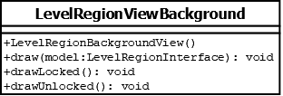

# LevelRegionViewBackground

## Summary
Represents the shaded or unshaded area drawn behind tower buttons.

## Diagram

## Constructors
* **LevelRegionBackgroundView()**: constructs a `LevelRegionBackgroundView` object.

## Methods
* **draw(model (LevelRegionInterface))** (void): if `model.isUnlocked()` returns `true` then calls `drawUnlocked()`; else calls `drawLocked()`
* **drawLocked()** (void): draws a shaded background.
* **drawUnlocked()** (void): draws an unshaded background.
