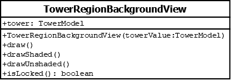

# TowerRegionBackgroundView

## Summary
Represents the shaded or unshaded area drawn behind tower buttons.

## Diagram

## Constructors
* **TowerRegionBackgroundView(towerValue (TowerModel))**: constructs a `TowerRegionBackgroundView` object with the `tower` attribute set to `towerValue`.

## Attributes
* *tower* (TowerModel): the `TowerModel` used for determining if the background should be drawn shaded or unshaded.

## Methods
* **draw()** (void): if `isLocked()` returns `true` then calls `drawShaded()`; else calls `drawUnshaded()`
* **drawShaded()** (void): draws a shaded background.
* **drawUnshaded()** (void): draws an unshaded background.
* **isLocked()** (boolean): returns `true` if the tower region's `TowerRegionStatusEnum` value is `UNSELECTABLE` or `LOCKED`; else returns `false` if the region is `UNLOCKED` or `SELECTED`; else throws an error because of an unexpected value.
