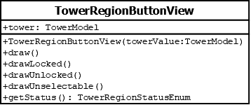

# TowerRegionButtonView

## Summary
Represents the button drawn in a tower region.

## Diagram

## Constructors
* **TowerRegionButtonView(towerValue (TowerModel))**: constructs a `TowerRegionView` object with the `tower` attribute set to `towerValue`.

## Attributes
* *tower* (TowerModel): the `TowerModel` used for determining if the button is `selected`, `unlocked`, `locked`, or `unselectable`.

## Methods
* **draw()** (void): calls `drawSelected()` if `getStatus()` returns `SELECTED`; else calls `drawUnselectable()` if `getStatus()` returns `UNSELECTABLE`; else calls `drawUnlocked()` if `getStatus()` returns `UNLOCKED`; else calls `drawLocked()` if `getStatus()` returns `LOCKED`; else throws an error because an unexpected enum value was received.
* **drawLocked()** (void): draws a shaded button.
* **drawSelected()** (void): draws the button with a border around it.
* **drawUnlocked()** (void): draws an unshaded button.
* **drawUnselectable()** (void): draws nothing.
* **getStatus()** (TowerRegionStatusEnum): uses the `tower` attribute to return the `TowerRegionStatusEnum` value for determining what method the `draw()` method should call.
