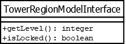

# TowerRegionModelInterface

## Summary
Hides the information about the model except for that needed by the TowerRegionView.
***This is an interface.***

## Diagram

## Attributes
* ***This is an interface.***

## Constructors
* ***This is an interface.***

## Methods
* **getLevel()** (integer): returns the level number corresponding to this region.
* **isLocked()** (boolean): returns `true` if this region has been unlocked by the player; else returns `false`.
