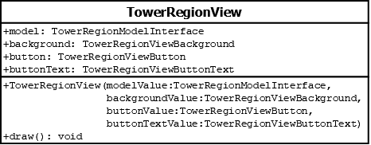

# TowerRegionView

## Summary
Represents one of the seven parts of the tower to draw.

## Diagram

## Constructors
* **TowerRegionView(backgroundValue (TowerRegionBackgroundView), buttonValue (TowerRegionButtonView))**: constructs a **TowerRegionView** object with the `background` attribute set to `backgroundValue` and the `button` attribute set to `buttonValue`.

## Attributes
* **background** (TowerRegionBackgroundView): the background sprite upon which the button will be drawn.
* **button** (TowerRegionButtonView): the button associated with selecting a level or scrolling up / down.

## Methods
* **draw()** (void): draws the background and then draws the button.
