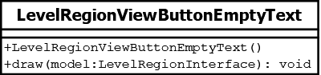

# LevelRegionViewButtonEmptyText

## Summary
Subclasses the LevelRegionViewButtonEmptyText class in order to override the `draw` implementation.
Represents the empty text displayed on the scroll buttons drawn in a tower region.
That is to say, scroll buttons do not have text so this class does not draw any.

## Diagram

## Constructors
* **LevelRegionViewButtonEmptyText()**: constructs a `LevelRegionViewButtonEmptyText` object.

## Methods
* **draw(model (LevelRegionInterface))** (void): overridden to not draw anything.
