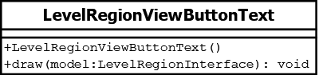

# LevelRegionViewButtonText

## Summary
Represents the text displayed on the button drawn in a tower region.

## Diagram

## Constructors
* **LevelRegionViewButtonText()**: constructs a `LevelRegionViewButtonText` object.

## Methods
* **draw(model (LevelRegionInterface))** (void): draws "Level {0}" where {0} is `model.getLevelNumber()` in string form.
