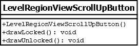

# LevelRegionViewScrollUpButton

## Summary
Subclasses the LevelRegionViewButton class in order to override `drawLocked()` and `drawUnlocked()` implementations.
Represents a button drawn in a tower region that corresponds to scrolling up in the level selection menu.

## Diagram

## Constructors
* **LevelRegionViewScrollUpButton()**: constructs a `LevelRegionViewScrollUpButton` object.

## Methods
* **drawLocked()** (void): overridden to draw a shaded up arrow button.
* **drawUnlocked()** (void): overridden to draw an unshaded up arrow button.
