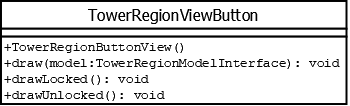

# TowerRegionViewButton

## Summary
Represents the button drawn in a tower region.
***This is an abstract class.***

## Diagram

## Constructors
* ***This is an abstract class.***

## Methods
* **draw(model(TowerRegionModelInterface))** (void): calls `drawUnlocked()` if `model.isUnlocked()` returns true; otherwise calls `drawLocked()`; however if `model.getLevelNumber()` is less than `1` then nothing is drawn.
* **drawLocked()** (void): *(abstract method)* draws a shaded button.
* **drawUnlocked()** (void): *(abstract method)* draws an unshaded button.
