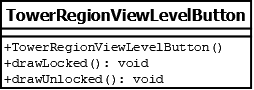

# TowerRegionViewLevelButton

## Summary
Subclasses the TowerRegionViewButton class in order to override `drawLocked()` and `drawUnlocked()` implementations.
Represents a button drawn in a tower region that corresponds to selecting a level.

## Diagram

## Constructors
* **TowerRegionViewLevelButton()**: constructs a `TowerRegionViewLevelButton` object.

## Methods
* **drawLocked()** (void): overridden to draw a rectangular shaded button.
* **drawUnlocked()** (void): overridden to draw a rectangular unshaded button.
