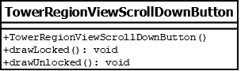

# TowerRegionViewScrollDownButton

## Summary
Subclasses the TowerRegionViewButton class in order to override `drawLocked()` and `drawUnlocked()` implementations.
Represents a button drawn in a tower region that corresponds to scrolling down in the level selection menu.

## Diagram

## Constructors
* **TowerRegionViewScrollDownButton()**: constructs a `TowerRegionViewScrollDownButton` object.

## Methods
* **drawLocked()** (void): overridden to draw a shaded down arrow button.
* **drawUnlocked()** (void): overridden to draw an unshaded down arrow button.
